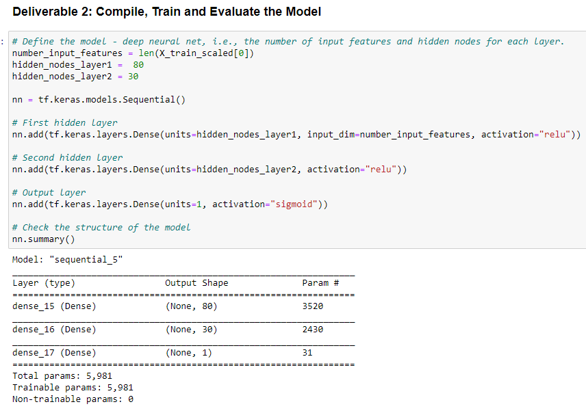
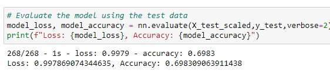
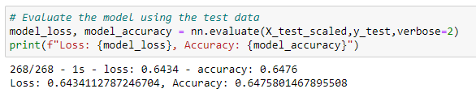
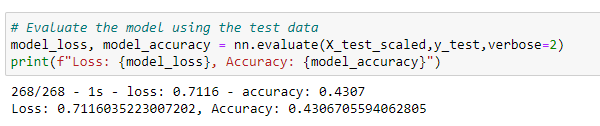
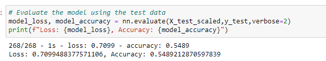

# Neural Network Charity Analysis

## **Overview of the analysis**: 

#### The purpose of this analysis was to assist Alphabet Soup predict where to make investments, analyzing data from more than 34,000 organizations that have received funding from Alphabet Soup over the years.

##### The dataset we reviewed including the following columns:

###### * EIN and NAME—Identification columns
###### * APPLICATION_TYPE—Alphabet Soup application type
###### * AFFILIATION—Affiliated sector of industry
###### * CLASSIFICATION—Government organization classification
###### * USE_CASE—Use case for funding
###### * ORGANIZATION—Organization type
###### * STATUS—Active status
###### * INCOME_AMT—Income classification
###### * SPECIAL_CONSIDERATIONS—Special consideration for application
###### * ASK_AMT—Funding amount requested
###### * IS_SUCCESSFUL—Was the money used effectively

## **Results of the Analysis**:

### * Data Preprocessing:

#### - What variable(s) are considered the target(s) for your model? The **IS_SUCCESSFUL** column is our target for the deep learning neural network.
#### - What variable(s) are considered to be the features for your model? All other columns, with the exception of our target, IS_SUCCESSFUL and the dropped columns, EIN and NAME, are our features in the dataset.
#### - What variable(s) are neither targets nor features, and should be removed from the input data? the **EIN** and **NAME** columns were removed from the input data as they provide no value to our model.

### * Compiling, Training, and Evaluating the Model:

#### - How many neurons, layers, and activation functions did you select for your neural network model, and why? We selected 2 hidden layers, with 80 neurons in the first hidden layer and 30 neurons in the second layer. Our output layer is comprised on a single neuron. With these, we were able to achieve a total of 5,981 parameters per the starter code. Finally, we selected the **ReLU** activation method for the hidden layers, as it is one of the most used/efficient activation functions. Our output layer activation method is **Sigmoid** as we want a probablity between 0 and 1 in our output. 

#### - Were you able to achieve the target model performance? Unfortunately, with the above method, we were only able to achieve an accuracy rate od 70%, which is below the target 75% accuracy rate. Therefore, we can conclude that under these conditions, our deep learning model is not going to help Alphabet Soup accurately predict which charity to financially support.

#### - What steps did you take to try and increase model performance? 

##### Our first attempt was to try to remove 2 additional variables, which we considered "noisy". Therefore, this attempt elimiated the following variables: EIN, NAME, USE_CASE, SPECIAL_CONSIDERATIONS. Leaving the rest of the function the same, our accuracy rate decreased to **65%**.

##### Our second attempt was, in addition to removing the 2 "noisy" variables, to increase our hidden layers from 2 to 3, and to increase our neurons to 100, 80 and 50 respectively. Under this scenario, again, our accuracy rate decreased to **43%**.

##### Our third and last attempt was, in addition to removing the 2 "noisy" variables and increasing both the number of hiddent layers and neurons, to change the activation method from ReLU to Tanh for all hidden layers, keeping the activation method to Sigmoid for the Output layer. Again, our accuracy rate decreased to **55%**.

## **Summary of the analysis**: 

### The deep learning neural network model did not achieve the desired 75% accuracy, even after applying several optimization techniques. These various optimization techniques may had led our model to be overfitted. 

### Because our target varibale, 'IS_SUCCESSFUL', has only 2 outcomes, 0 or 1, and is thefore considered a binary classification problem, we could use a supervised machine learning model such as the **Random Forest Classifier** to combine a multitude of decision trees to generate a classified output and evaluate its performance against our deep learning model. It is likely that the accuracy rate would outperform the deep learning model's.

